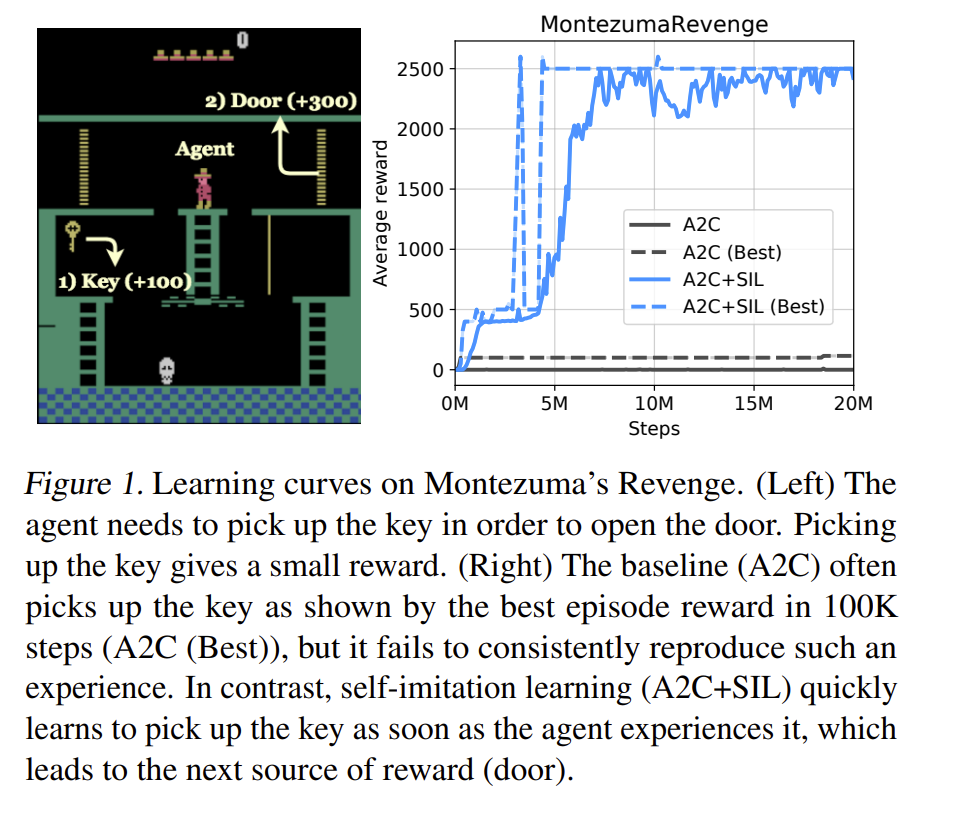
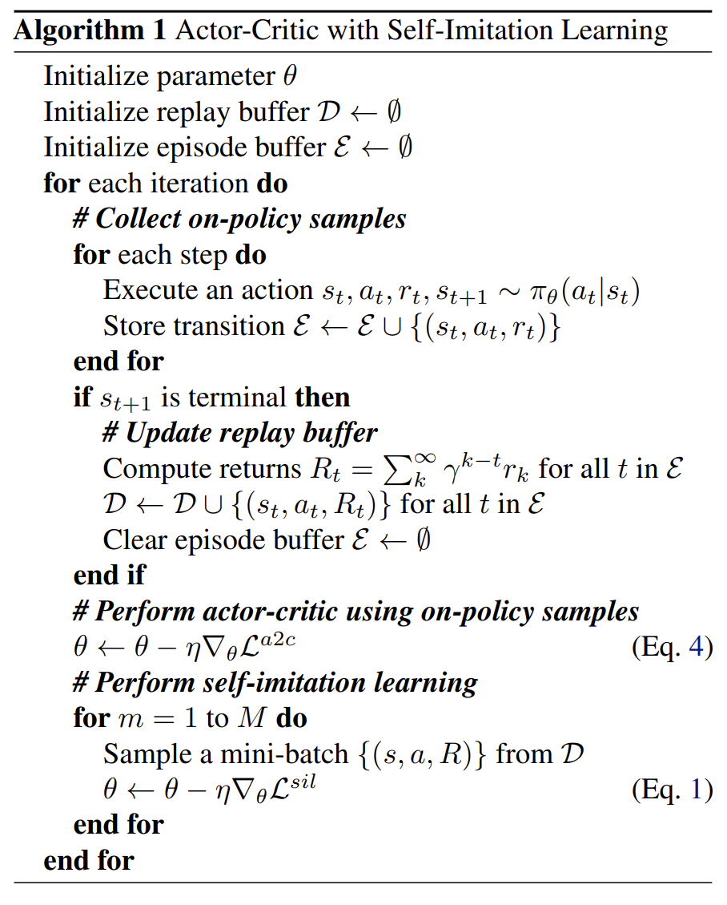

# [Self-Imitation Learning](https://arxiv.org/abs/1806.05635)

## Motivation
在稀疏奖励的条件下，agent很难获得有效的获得reward的奖励反馈；为此若是能够利用，偶然获得历史上的reward的经验借鉴学习，便可以更好的在稀疏环境中获取奖励。

下图展示在Atari MontezumaRevenge环境下SIL的性能表现，在稀疏环境下，agent能显著的好于baseline方法。

## Method
SIL希望能够从agent过去偶然探索好的经验中模仿，使得模仿后的效果不次于探索至今的最好情况。
基于此前提下，将过往的episodes都存储在ReplayBuffer 
$\mathcal D=\left\{ \left( s_t, a_t, R_t=\sum_{k=t}^{\infty}\gamma^{k-t}r_k \right) \right\}$
其中，$r_k$为step k的当前reward。

那么，在Actor-Critic框架下自模仿损失如下

$$
    \left \{ 
        \begin{aligned}
            & \mathcal L^{sil} = \mathbb E_{s, a, R \in \mathcal D}[\mathcal L^{sil}_{policy} + \beta^{sil} \mathcal L^{sil}_{value}] \\
            & \mathcal L^{sil}_{policy} = - \mathop{\log}\pi_\theta(a|s)\left (R-V_\theta(s) \right )_+ \\
            & \mathcal L^{sil}_{value} = \frac{1}{2} ||R-V_\theta(s) ||^2_+
        \end{aligned}
    \right. 
$$

其中 $\left( \cdot \right )_+ = \mathop{\max}\left ( \cdot, 0\right )$, $\pi_\theta(\cdot) \& V_\theta(\cdot)$分别代表以$\theta$为参数的actor & critic 网络，$\beta^{sil} \in \mathbb R^+$是平衡超参数。

loss直觉解释，对于$\mathcal L^{sil}_{policy}$对历史上的轨迹，如果比当前value函数的估值要高就尽可能模仿历史（Replay Buffer）上的动作；
对于$\mathcal L^{sil}_{value}$，尽可能保有在历史状态(Replay Buffer)和当前探索最大状态估值。

### A2C with SIL
将A2C loss 和 SIL loss结合即可得到该框架方法

$$
    \left \{ 
        \begin{aligned}
            & \mathcal L^{a2c} = \mathbb E_{s, a \sim \pi_\theta}[\mathcal L^{a2c}_{policy} + \beta^{a2c} \mathcal L^{a2c}_{value}] \\
            & \mathcal L^{a2c}_{policy} = - \mathop{\log}\pi_\theta(a|s)\left (V_t^n-V_\theta(s) \right ) + \alpha \mathcal H_t^{\pi_\theta}\\
            & \mathcal L^{a2c}_{value} = \frac{1}{2} ||V_t^n-V_\theta(s) ||^2
        \end{aligned}
    \right. 
$$

其中$V_t^n = \sum_{d=0}^{n-1} \gamma^d r_{t+d} + \gamma^n V_\theta(s_{t+n})$是n-step episode 价值估计

可得到如下算法

### Prioritized Replay
为了尽可能好的采样$\mathcal D$中的样本，将$||R-V_\theta(s) ||_+$作为每个样本的采样权重，这样便可以在Replay Buffer中尽可能采样比当前策略好的状态轨迹。

## Experiment
