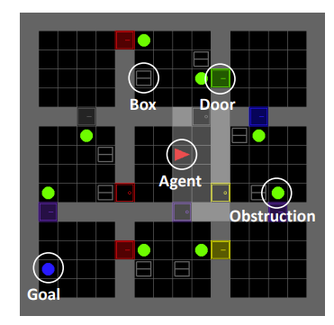
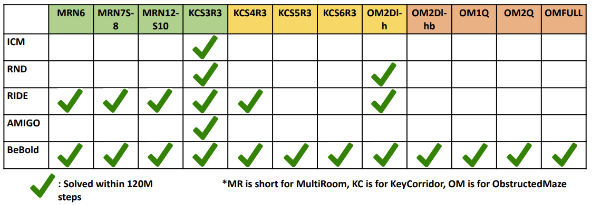
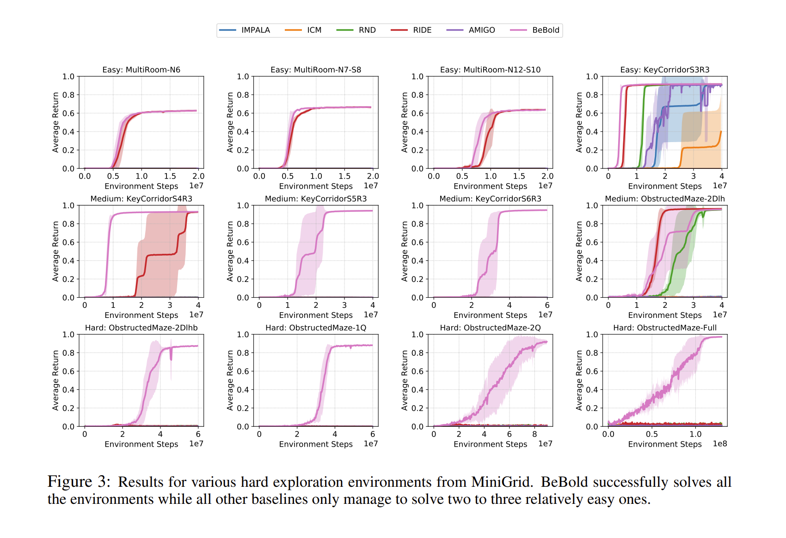
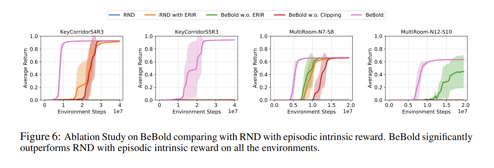

# BeBold: Exploration Beyond the Boundary of Explored Regions
[arxiv](https://arxiv.org/abs/2012.08621)

## Motivation
在强化学习中探索问题一直是令人头疼的问题，特别是当环境没有中间奖励，只有完成终态才能获取奖励反馈（**稀疏奖励**），在这样的情况下就使得学习变得非常困难。文章希望通过设计环境语义无关的agent自发驱动探索的内生奖励，鼓励agent在环境中的探索，以更高效的获取有效学习轨迹。

## Method
### Exploration Beyond the Boundary
内在驱动的探索奖励的设计直觉性非常好。其期望在agent熟悉状态的边缘向外部不熟悉的状态探索。$N(s_t)$是对状态$s_t$的访问次数。
$$r^{intrinsic} = \mathop{\max} \left (\frac{1}{N(s_{t+1})} - \frac{1}{N(s_t)}, 0 \right )$$

### 连续状态空间计数
尽管上述intrinsic reward 可以很好的鼓励agent在熟悉状态边缘向外探索，但是由于需要对状态进行计数，这样的函数似乎在无限状态空间上并不能实现。这里后边使用了我本人觉得很优美的一个trick。

对神经网络来说在给定训练集场景下，训练损失会随迭代的次数逐步降低。文章便是利用这一特性，估计连续状态空间访问计数估计问题。
随机初始化两个不同的神经网络$\phi(\cdot)$ & $\phi \prime (\cdot)$，以$\phi(s)$作为$\phi \prime (s)$拟合目标。当$s$的访问次数越多时，其损失$\mathcal L = ||\phi \prime (s) - \phi (s)||_2$便越小。

$$N(s) \approx \frac{1}{||\phi \prime (s) - \phi (s)||_2}$$

如上图所示，开始agent会在自己的房间里转悠，使得房间内的状态访问次数都比较大，而通往其它房间的状态的访问次数比较小，就使得通往其它房间的状态instrinsic reward变大而去访问新的状态。

便可以得出$r^{intrinsic}$的估计

$$r^{intrinsic} = \mathop{\max} \left (||\phi \prime (s_{t+1}) - \phi (s_{t+1})||_2 - ||\phi \prime (s_t) - \phi (s_t)||_2, 0 \right )$$

### Episodic Restriction on Intrinsic Reward (ERIR)
在多数情况下环境内之间的状态是可逆的，如果直接使用intrinsic reward引导agent探索很可能使agent在状态$s_{t+1}$和之前相对充分探索的状态之间反复跳转。为避免这种弊端，文章中仅仅对一条轨迹中的第一次访问$s_{t+1}$产生instrinsic reward。$\mathbb I \left(N_e(s_{t+1}) = 1\right)$表示在一条轨迹中第一次出现状态$s_{t+1}$。

$$r^{ERIR} = \mathop{\max} \left (||\phi \prime (s_{t+1}) - \phi (s_{t+1})||_2 - ||\phi \prime (s_t) - \phi (s_t)||_2, 0 \right ) \cdot \mathbb I \left ( N_e \left ( s^{t+1} \right ) = 1 \right )$$

## Experiment

上图展现BeBold强大的探索能力，所有MiniGrid环境都能被解决。

### Abalation Study
* $ERIR = \mathop{(\cdot) \cdot \mathbb I \left(N_e(s_{t+1}) = 1\right)}$
* $Clipping = \mathop{\max} \left (||\phi \prime (s_{t+1}) - \phi (s_{t+1})||_2 - ||\phi \prime (s_t) - \phi (s_t)||_2, 0 \right )$
* $w/o \ Clipping = ||\phi \prime (s_{t+1}) - \phi (s_{t+1})||_2 - ||\phi \prime (s_t) - \phi (s_t)||_2$

