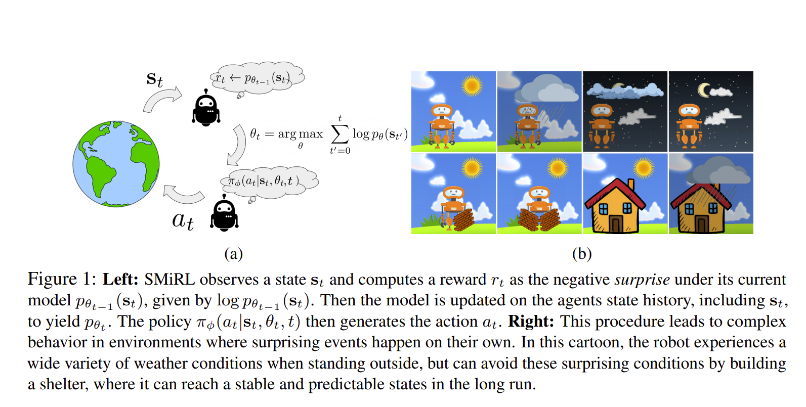
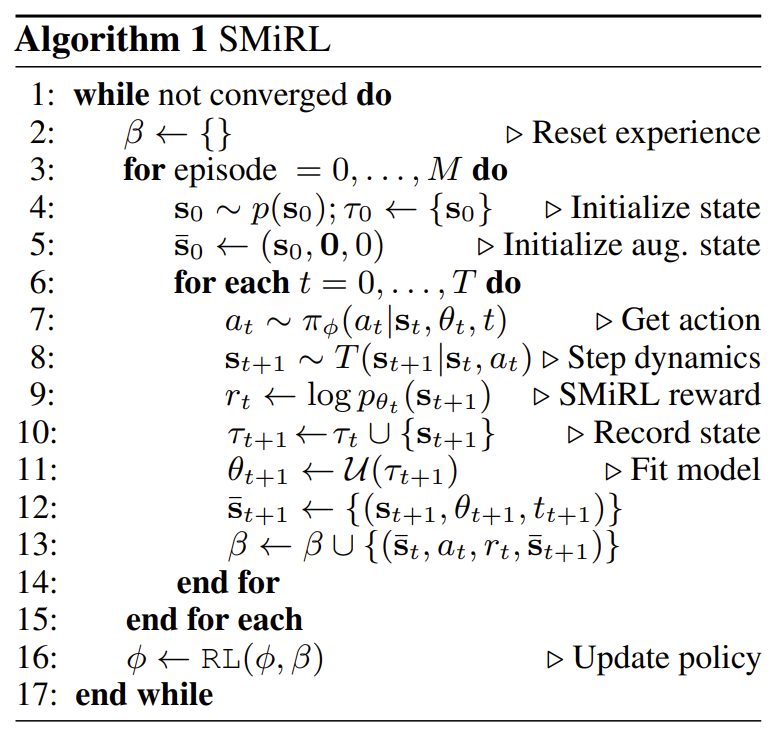

# [SMiRL: Surprise Minimizing Reinforcement Learning in Unstable Environments](https://openreview.net/pdf?id=cPZOyoDloxl)

## Motivation
本篇文章的动机非常有趣，不同于以往intrinsic motivation鼓励agent探索的思路，其更希望agent能够在非稳态的环境中保持相对的稳态。

文章认为在真实世界的非稳态环境中，agent本就有充分多的对外界环境的探索源泉，而在这之中更具挑战的是能够在这些非稳态的环境中尽可能避免由于非稳态环境的意外带给agent的干扰而打破平衡。
因此，文章也提出SMiRL方法以维持agent观测状态分布$p_\theta(\boldsymbol s)$为稳态分布。
如下图展示的例子所示，如果agent在野外不做任何目的性的动作，其观测的状态将非常不稳定，可能有各种天气，然而，如果其建造一座房子则可以使其长期处于室内的稳态。

## Method
agent策略为$\pi_\phi\left ( a | \boldsymbol s \right )$其目标为最小化$\pi_\phi$下的状态边缘分布$d^{\pi_\phi}(\boldsymbol s)$。
相应的利用$p_\theta$可以估计$d^{\pi_\phi}$,可以得到如下目标：

$$\sum_{t=0}^{T} \mathcal H(\boldsymbol s_t) = - \sum_{t=0}^{T} \mathbb E_{\boldsymbol s_t \sim d^{\pi_\phi}(\boldsymbol s_t)}\left [\mathop{log} d^{\pi_\phi}(\boldsymbol s_t) \right ] \leq - \sum_{t=0}^{T} \mathbb E_{\boldsymbol s_t \sim d^{\pi_\phi}(\boldsymbol s_t)}\left [\mathop{log} p_{\theta_{t-1}}(\boldsymbol s_t) \right ]$$

上述$p_{\theta_{t-1}}$为利用当前已观测的序列$\tau_t = \left \{\boldsymbol s_1, \cdots, \boldsymbol s_t \right \}$的估计。

由于在最小化episode的状态分布的熵，则可以设计学习的reward如下：

$$\boldsymbol r(\boldsymbol s_t) = \mathop{log} p_{\theta_{t-1}}(\boldsymbol s_t)$$

